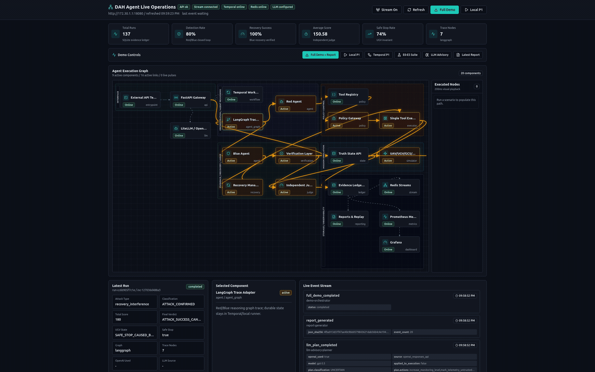
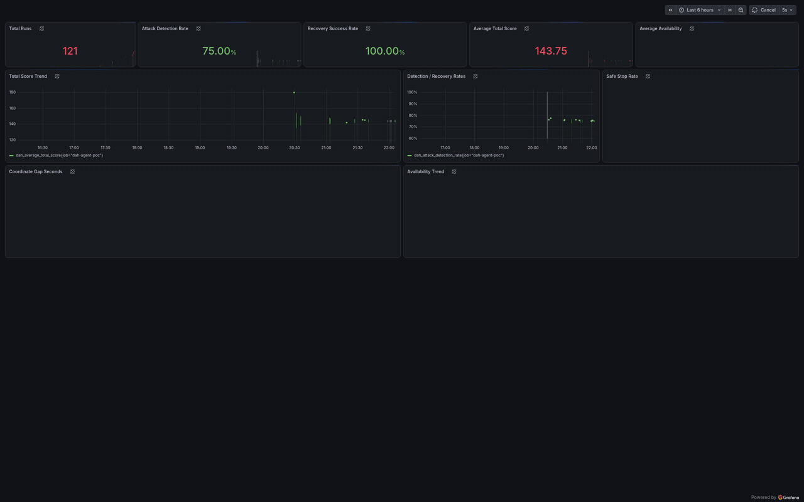
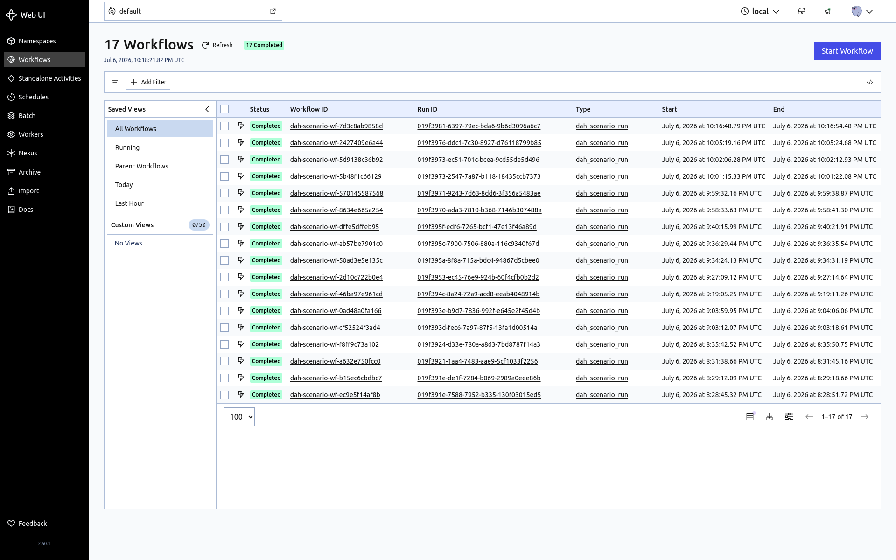
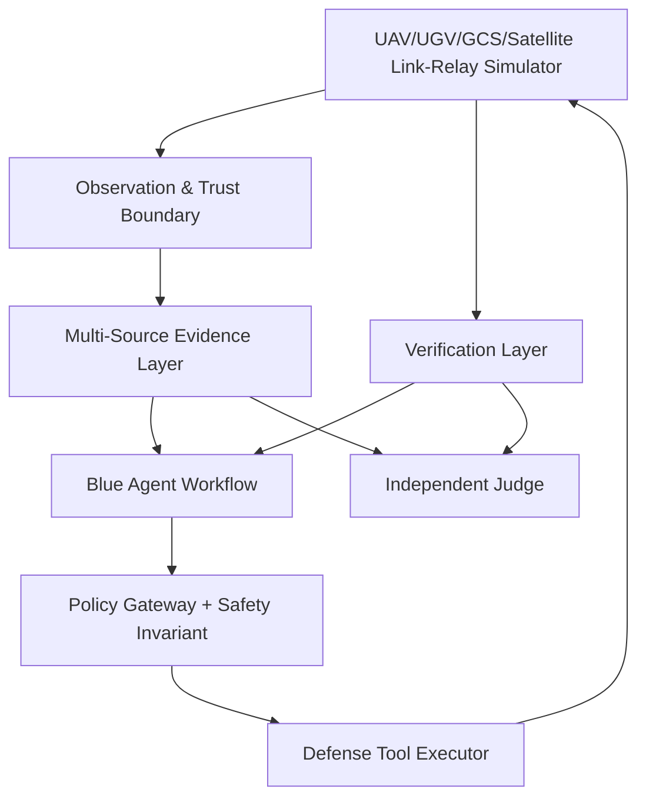
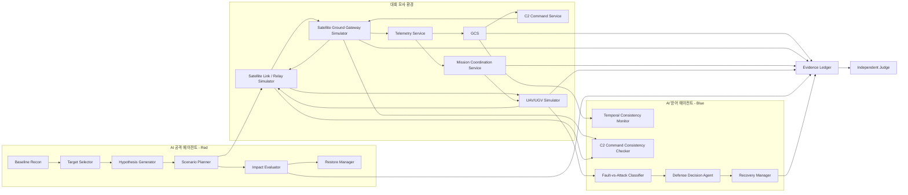

# DAH 2026 UAV·UGV 협업 임무 공격·방어 에이전트

이 저장소는 **DAH 2026 예선 보고서**의 공격 시나리오, 방어 아키텍처, Red/Blue AI 에이전트 설계, Judge·Evidence Ledger·Replay Harness 설계를 담은 부가자료 저장소입니다.

보고서의 핵심 시나리오는 **위성 데이터링크 모사 구간의 정찰 좌표 보고 차단 및 텔레메트리 재전송 효과 주입을 통한 UAV·UGV 협업 임무 교란**입니다. 실제 침투나 파괴가 아니라 통제된 시뮬레이션 안에서 공격·방어 AI의 관측, 판단, 행동, 검증 능력을 비교하는 것을 목표로 합니다.

## 요구사항

가장 간단한 실행 방법은 Docker Compose입니다. 기본 구성은 FastAPI, Agent Dashboard, Grafana를 실행하며 Temporal, Redis Streams, 외부 LLM은 선택 사항입니다.

| 구분 | 필수 여부 | 요구사항 |
| --- | --- | --- |
| Git | 필수 | 저장소 복제 및 버전 관리 |
| Docker | 권장·필수 | Docker Engine과 Docker Compose v2 플러그인 |
| 시스템 자원 | 권장 | 기본 구성 2GB 이상, Temporal 포함 시 4GB 이상의 가용 메모리 |
| Python | 로컬 개발 시 | Python 3.12 권장 |
| Node.js | 대시보드 로컬 개발 시 | Node.js `^20.19.0` 또는 `>=22.12.0`, npm |
| PostgreSQL | Temporal 사용 시 | 컨테이너에서 접근 가능한 PostgreSQL과 `temporal`, `temporal_visibility` 데이터베이스 |
| Redis | 선택 | 컨테이너에서 접근 가능한 Redis 5 이상 |
| OpenAI 호환 API | 선택 | LLM advisory plan을 사용할 경우 API key, base URL, model 이름 |

기본 구성에서 사용하는 호스트 포트는 다음과 같습니다. 다른 프로세스가 해당 포트를 사용 중이면 `docker-compose.yml`의 포트 매핑을 변경해야 합니다.

| 서비스 | 주소 |
| --- | --- |
| Agent Dashboard | `http://127.0.0.1:18081` |
| FastAPI | `http://127.0.0.1:18080` |
| Swagger UI | `http://127.0.0.1:18080/docs` |
| Grafana | `http://127.0.0.1:13000` |
| Temporal gRPC | `127.0.0.1:17233` |
| Temporal UI | `http://127.0.0.1:18233` |

## 설치 방법

### 1. Docker Compose로 기본 구성 실행

저장소를 복제합니다.

```bash
git clone https://github.com/uaysk/dah_agent.git
cd dah_agent
```

프로젝트 루트에 `.env` 파일을 만들고 최소한 Grafana 관리자 비밀번호를 설정합니다. `.env`는 Git에 포함하면 안 됩니다.

```dotenv
GRAFANA_ADMIN_PASSWORD=change-this-password

# 선택: 외부에 노출되는 보고서 URL의 기준 주소
PUBLIC_BASE_URL=http://127.0.0.1:18080

# 선택: LLM을 사용하지 않으면 비워 둡니다.
OPENAI_API_KEY=
OPENAI_BASE_URL=https://your-openai-compatible-endpoint.example
OPENAI_MODEL=your-model-name
OPENAI_REASONING_EFFORT=low

# 기본 실행에서는 비활성화합니다.
TEMPORAL_ENABLED=false
REDIS_STREAMS_ENABLED=false
```

기본 서비스를 빌드하고 실행합니다.

```bash
docker compose up --build -d
docker compose ps
```

API와 대시보드 상태를 확인합니다.

```bash
curl http://127.0.0.1:18080/health
curl http://127.0.0.1:18080/dashboard/state
```

전체 데모는 다음 API로 실행할 수 있습니다. Temporal이 비활성화된 기본 구성에서는 Temporal 단계만 실패로 기록되고 나머지 로컬 시나리오, E0~E5 suite, LLM fallback, 보고서 생성은 계속 실행됩니다.

```bash
curl -X POST http://127.0.0.1:18080/demo/run-full \
  -H 'Content-Type: application/json' \
  -d '{}'
```

서비스를 종료할 때는 다음 명령을 사용합니다. SQLite 실행 데이터는 `data/`에 유지됩니다.

```bash
docker compose down
```

### 2. Temporal 구성 활성화

Temporal은 선택적 durable workflow 경로입니다. 먼저 PostgreSQL에 `temporal`, `temporal_visibility` 데이터베이스를 준비하고, Docker 컨테이너에서 접근 가능한 주소와 계정을 `.env`에 설정합니다. 이 계정에는 Temporal schema를 초기화할 권한이 있어야 합니다.

```dotenv
TEMPORAL_ENABLED=true
TEMPORAL_ADDRESS=temporal:7233
TEMPORAL_NAMESPACE=default
TEMPORAL_TASK_QUEUE=dah-agent-task-queue

TEMPORAL_DB_HOST=postgres.example.internal
TEMPORAL_DB_PORT=5432
TEMPORAL_DB_USER=temporal
TEMPORAL_DB_PASSWORD=change-this-password
TEMPORAL_DB_NAME=temporal
TEMPORAL_VISIBILITY_DB_NAME=temporal_visibility
```

Temporal server, UI, worker를 포함해 실행합니다.

```bash
docker compose --profile temporal up --build -d
curl http://127.0.0.1:18080/temporal/health
```

Temporal UI는 `http://127.0.0.1:18233`에서 확인할 수 있습니다.

### 3. Redis Streams 활성화

Redis Streams는 SQLite Evidence Ledger의 best-effort event mirror입니다. Redis 장애가 시나리오 실행을 중단시키지는 않습니다. `REDIS_URL`에는 컨테이너 내부의 `localhost`가 아니라 컨테이너에서 실제로 접근 가능한 DNS 이름 또는 IP를 사용해야 합니다.

```dotenv
REDIS_STREAMS_ENABLED=true
REDIS_URL=redis://redis.example.internal:6379/0
REDIS_STREAM_PREFIX=dah
REDIS_STREAM_MAXLEN=10000
```

설정을 변경한 뒤 애플리케이션과 worker를 다시 생성합니다.

```bash
docker compose --profile temporal up --build -d --force-recreate dah-agent-poc temporal-worker
curl http://127.0.0.1:18080/streams/status
```

Temporal을 사용하지 않는 경우에는 다음 명령으로 API만 다시 생성하면 됩니다.

```bash
docker compose up --build -d --force-recreate dah-agent-poc
```

### 4. 로컬 개발 환경

FastAPI와 테스트를 Docker 없이 실행하려면 Python 가상환경을 사용합니다.

```bash
python3.12 -m venv .venv
source .venv/bin/activate
python -m pip install --upgrade pip
python -m pip install -r requirements.txt
mkdir -p data
uvicorn app.main:app --reload --host 0.0.0.0 --port 18080
```

테스트는 프로젝트 루트에서 실행합니다.

```bash
pytest -q
```

대시보드를 개발 모드로 실행하려면 별도 터미널에서 다음 명령을 사용합니다.

```bash
cd dashboard
npm ci
VITE_API_BASE_URL=http://127.0.0.1:18080 npm run dev
```

개발 서버는 `http://127.0.0.1:5173`에서 열립니다. 프로덕션 Docker 대시보드는 Nginx의 same-origin proxy를 사용하므로 `VITE_API_BASE_URL` 설정이 필요하지 않습니다.

## 핵심 평가 목표

대회 관점의 핵심은 **Red Agent가 허용된 공격 주입 API만으로 목표 임무 영향을 얼마나 안정적으로 만들어내는지**와 **Blue Agent가 그 공격을 얼마나 정확히 탐지·완화·복구하는지**입니다. 따라서 본 저장소의 시뮬레이션, Judge, Evidence Ledger, 대시보드는 모두 아래 두 축을 중심으로 결과를 산출합니다.

| 평가 축 | 핵심 지표 | 판단 기준 |
| --- | --- | --- |
| Red Agent 공격 성공률 | `attack_success_rate`, `attack_score`, mission impact | 목표 flow 선택, 선택적 차단·복구 방해·display replay-effect 실행, UGV Safe Stop·임무 지연·GCS-Truth 불일치 유도 |
| Blue Agent 방어 성공률 | `defense_success_rate`, `recovery_success_rate`, `defense_score` | 공격/정상 장애 분류, 대응 도구 선택, quarantine/resync/restore 실행, 복구 검증 |
| 임무 가용성 | `availability`, `safe_stop_rate`, `total_score` | 공격 성공과 방어 대응 이후에도 안전 정책과 임무 지속성이 보존되는지 |

최종 보고서 JSON은 Judge가 산출한 `attack_score`, `defense_score`, `availability`, `total_score`, `final_verdict`를 포함하며, Grafana와 Agent Dashboard는 같은 실행 결과를 시각화합니다.

## 작동 흐름 빠른 보기

아래 이미지는 Agent Dashboard, Grafana, Temporal UI에서 확인할 수 있는 주요 실행 결과입니다. Agent Dashboard의 노드 강조와 Executed Nodes 재생은 동작 과정을 쉽게 확인하기 위한 200ms 시각화 간격이며, 실제 API 실행·Temporal workflow·보고서 생성 자체를 지연시키지는 않습니다.

Agent Dashboard는 Full Demo API 실행 중 SSE 이벤트가 그래프 노드, 링크, Executed Nodes 패널에 반영되는 과정을 1920x1200 해상도와 약 200ms 간격으로 캡처한 GIF입니다.



Grafana Metrics는 실행 결과가 Prometheus 호환 API를 통해 대시보드 패널에 반영되는 상태를 보여줍니다.



Temporal Workflow는 Full Demo 중 생성된 `dah_scenario_run` workflow 목록을 보여주는 정적 캡처입니다.



Full Demo 결과 JSON 예시는 [docs/examples/full-demo-report.example.json](docs/examples/full-demo-report.example.json)에서 확인할 수 있습니다. 아래는 해당 파일의 핵심 필드 일부입니다.

```json
{
  "run_id": "run-d10b361963d4",
  "json_report": {
    "scenario_request": {
      "attack_type": "selective_message_drop"
    },
    "classification": {
      "classification": "ATTACK_CONFIRMED"
    },
    "judge_audit_event": {
      "final_verdict": "ATTACK_SUCCESS_CANDIDATE"
    },
    "judge_verdict": {
      "total_score": 180.0
    },
    "evidence_ledger": {
      "event_count": 22
    },
    "agent_graph": {
      "framework": "langgraph"
    },
    "llm_plan": {
      "openai_used": true,
      "source": "openai_responses_api",
      "model": "gpt-5.5"
    }
  }
}
```

LiteLLM 요청/응답 로그에서 `user_request`와 `llm_response`만 잘라낸 예시는 [docs/examples/litellm-request-response.example.json](docs/examples/litellm-request-response.example.json)에서 확인할 수 있습니다. LLM은 공격 판정 결과, 임무 영향, 허용 도구 목록을 입력으로 받고, 고정 JSON schema에 맞는 advisory plan만 반환합니다.

```json
{
  "user_request": {
    "model": "gpt-5.5",
    "reasoning": {
      "effort": "low"
    },
    "response_format": {
      "type": "json_schema",
      "name": "dah_agent_plan",
      "required": [
        "classification",
        "recommended_actions",
        "rationale",
        "safety_notes"
      ],
      "strict": true
    },
    "incident": {
      "attack_type": "selective_message_drop",
      "classification": "ATTACK_CONFIRMED",
      "attack_score": 0.95,
      "fault_score": 0.1,
      "red_tool": "simulate_selective_message_drop",
      "red_tool_policy_result": "ALLOW",
      "planned_defense_actions": [
        "increase_monitoring_level",
        "mark_telemetry_untrusted",
        "quarantine_link_session",
        "request_state_resynchronization"
      ],
      "impact_result": {
        "technical_success": true,
        "target_drop_rate": 0.58,
        "max_consecutive_gap_seconds": 21.0,
        "safe_stop_second": 24,
        "ugv_state": "SAFE_STOP_CAUSED_BY_COORD_STALE"
      },
      "execution_boundary": "LLM output is audited but never executes tools directly.",
      "llm_role": "advisory_typed_plan_only"
    }
  },
  "llm_response": {
    "classification": "ATTACK_CONFIRMED selective_message_drop",
    "recommended_actions": [
      "increase_monitoring_level",
      "mark_telemetry_untrusted",
      "quarantine_link_session",
      "request_state_resynchronization"
    ],
    "rationale": "Attack response is recommended because observed evidence shows a specific command/report flow gap, coordinate freshness exceeded the 15s safe-stop threshold with a 21s max gap, gateway/vehicle delivery mismatch in mock truth state, and impact concentrated on a single session with low non-target impact rate.",
    "safety_notes": [
      "Maintain advisory-only handling; do not execute tools directly.",
      "Keep the affected link session quarantined before attempting restoration.",
      "After resynchronization, restore only through a validated session workflow if evidence confirms freshness and delivery consistency."
    ]
  }
}
```

## 시나리오 개요

| 항목 | 내용 |
| --- | --- |
| 대상 도메인 | UAV 정찰-UGV 이동 협업 임무, GCS, C2 Command Service, Satellite Ground Gateway Simulator, Satellite Link / Relay Simulator |
| 핵심 기술 | Return Link 정찰 좌표 보고 흐름 식별, 선택적 보고 차단, 조건부 복구 명령 제한, display replay-effect injection, freshness 검증, GCS 표시-Truth State 불일치 |
| 공격 목표 | 승인된 모사 API로 위성 데이터링크 모사 구간의 일부 보고·텔레메트리 흐름의 전달성·신선도를 교란하여 협업 임무를 지연 또는 중단 |
| 방어 목표 | 명령·게이트웨이·기체 수신 로그와 Verifier 상태 결과를 교차검증하여 공격과 정상 장애를 구분하고 안전하게 복구 |
| AI 활용 | Red Agent는 후보 흐름 분류·가설 선택·허용 도구 실행·효과 검증, Blue Agent는 이상 분류·대응 선택·복구 검증 수행 |
| 구현 방향 | 대회 제공 UAV·UGV·GCS·위성망 모사 환경, Scenario Injection API, Independent Judge |

한 줄 요약: 공격 AI 에이전트가 허가된 공격 주입 API만 사용해 UAV의 Return Link 정찰 좌표 보고 흐름을 연속 차단하고, 필요 시 복구·재동기화 명령과 오래된 텔레메트리 표시를 제한적으로 교란하여 GCS 화면과 실제 시뮬레이터 상태 사이의 불일치를 만들고 UAV·UGV 협업 임무의 가용성을 저하시킵니다.

## 운용 환경 가정

보고서는 GCS, C2 Command Service, Satellite Ground Gateway Simulator, Satellite Link / Relay Simulator, UAV Simulator, UGV Simulator로 구성된 폐쇄형 모사 환경을 전제로 합니다. UAV가 생성한 정찰 좌표는 Return Link를 통해 Telemetry Service와 Mission Coordination Service로 전달되며, UGV는 최신 좌표의 신선도를 기준으로 협업 이동을 수행합니다.

정상 임무 흐름은 다음과 같습니다.

1. Operator가 GCS에서 UAV 정찰 임무를 활성화합니다.
2. GCS는 C2 Command Service를 통해 UAV에 `SURVEY_START`, `WAYPOINT_UPDATE`, `RESYNC`, `RECOVERY` 등 정의된 명령을 전송합니다.
3. Satellite Ground Gateway Simulator는 명령을 Forward Link로 전달하고, Satellite Link / Relay Simulator는 이를 UAV 또는 UGV Simulator로 중계합니다.
4. UAV는 정찰 지점으로 이동하고, 정찰 좌표와 상태 텔레메트리를 Return Link를 통해 보고합니다.
5. Telemetry Service는 Return Link로 수집된 UAV 정찰 좌표를 GCS 표시 경로와 Mission Coordination Service로 분기합니다.
6. Mission Coordination Service는 정찰 좌표의 `mission_id`, `session_id`, `sequence_number`, `coord_created_at`을 검증한 뒤 UGV coordinate input으로 전달합니다.
7. UGV는 최신 정찰 좌표가 신선도 조건을 만족할 때만 협업 이동을 계속합니다.
8. 유효한 좌표가 15초 동안 수신되지 않으면 UGV는 안전 정책에 따라 Safe Stop으로 전환합니다.

핵심 운용 규칙은 다음과 같습니다.

| 규칙 | 내용 |
| --- | --- |
| 좌표 전달 경로 | UAV coordinate report는 `UAV → Return Link → Satellite Link/Relay → Satellite Ground Gateway → Telemetry Service → Mission Coordination Service → UGV coordinate input` 순서로만 UGV 협업 입력에 반영됩니다. |
| 좌표 신선도 정책 | UGV는 `coord_created_at`이 현재 시각 기준 5초 이내인 정찰 좌표만 신뢰합니다. |
| UGV Safe Stop 정책 | 유효 좌표가 15초 동안 없으면 UGV는 `SAFE_STOP_CAUSED_BY_COORD_STALE`로 전환합니다. |
| 메시지 상관관계 ID | 모든 명령·보고·표시 이벤트는 `mission_id`, `session_id`, `message_id`, `sequence_number`를 포함합니다. |
| 시간 동기화 | 모든 이벤트는 UTC epoch millisecond를 사용하며, 구성요소 간 허용 clock skew는 100ms 이하입니다. |
| 텔레메트리 재전송 효과 처리 | 실제 메시지 위조나 Return Link frame 재전송이 아니라 시뮬레이터의 display fault mode로 구현합니다. |
| Truth State 접근 | Red와 Blue는 Truth State 원본을 직접 읽지 못하며, Verifier가 만든 제한된 판정 결과만 받습니다. Judge만 전체 Truth State를 읽습니다. |

## 공격 시나리오

공격자는 링크 전체 탈취 권한을 갖지 않고, 위성 데이터링크 모사 구간의 논리적 메시지 조작만 수행합니다. 실제 인증키 탈취, 취약점 악용, 악성코드 배포, RF 방해 절차는 포함하지 않습니다.

공격 진행 단계는 다음과 같습니다.

1. 사전 준비 및 기준선 확보
2. 후보 흐름 식별
3. 공격 가설 수립
4. 정책 검사 및 선택적 차단 실행(P1)
5. 상태 기만 실행(P3, 선택)
6. 임무 영향 검증
7. 방어 대응 관찰 및 원상복구

주요 공격 경로는 다음과 같습니다.

| 경로 | 효과 | 핵심 검증 항목 |
| --- | --- | --- |
| P1 좌표 보고 연속 차단 | Return Link 좌표 gap으로 UGV 좌표 신선도 만료 및 Safe Stop 유도 | 대상 차단률, 연속 좌표 공백, UGV Safe Stop 지속시간 |
| P2 복구·재동기화 명령 제한 | recovery/resync 지연으로 공격 지속시간 증가 | recovery command gap, ACK 지연, command delivery 재개율 |
| P3 display replay-effect | GCS 표시 상태와 Truth State 불일치 유도 | timestamp 정체, payload hash 반복, display-verifier mismatch |

## 방어 아키텍처

방어 목표는 공격자를 즉시 차단하는 것만이 아니라, 정상 장애와 공격을 구분하면서 임무 가용성과 안전을 동시에 보존하는 것입니다.



| 계층 | 역할 | 주요 산출물 |
| --- | --- | --- |
| Observation & Trust Boundary | 로그·텔레메트리를 비신뢰 데이터로 정규화 | normalized event |
| Multi-Source Evidence Layer | 명령·텔레메트리·상태·임무 증거 연결 | evidence_refs, confidence |
| Blue Agent Workflow | 분류, 대응 계획, 복구 판단 | defense plan |
| Policy Gateway | 도구 실행 전 위험도와 allowlist 검증 | policy decision |
| Defense Tool Executor | 단일 상태 변경 경로 | tool execution result |
| Verification Layer | 도구 응답과 실제 상태 변화를 분리 검증 | verification result |
| Independent Judge | Truth State와 감사 로그로 점수 판정 | judge decision |

방어 원칙은 다중 증거 기반 판단, 정상 장애 분리, 최소 영향 대응, 안전 우선, 복구 검증, 재현성 보장입니다.

## 멀티에이전트 구조

본 시스템은 AI 공격 에이전트(Red)와 AI 방어 에이전트(Blue)가 공통 시뮬레이션 환경에서 상호작용하는 멀티에이전트 구조로 설계됩니다. 두 에이전트는 단순 자동화 스크립트가 아니라 관측→가설 선택→행동→검증 루프를 수행하는 상태 머신입니다.



### Red Agent

Red Agent는 실제 공격자가 아니라, 대회가 허용한 모사 API 안에서 공격 효과를 자동 구성하는 방어 검증용 평가 에이전트입니다.

| 모듈 | 역할 |
| --- | --- |
| Baseline Recon Agent | 정상 명령 전달 시간, 텔레메트리 freshness, GCS-Truth 차이를 측정 |
| Target Selector | session_id, vehicle_id, command_type, report_type 후보 선택 |
| Hypothesis Generator | 명령 차단, 좌표 보고 차단, replay 가설 생성 |
| Scenario Planner | Tool Registry에 등록된 도구만 사용해 단계 계획 작성 |
| Policy Check Adapter | 위험 등급, allowlist, timeout, idempotency_key 확인 요청 |
| Impact Evaluator | 기술 효과와 임무 영향 분리 검증 |
| Restore Manager | 실패·종료·안전 조건 위반 시 원상복구 |

상태 머신:

```text
INITIALIZING
-> OBSERVING
-> DISCOVERING
-> HYPOTHESIZING
-> PLANNING
-> POLICY_CHECK
-> EXECUTING
-> VERIFYING
-> ADAPTING
-> OBJECTIVE_ACHIEVED 또는 TERMINATED
```

### Blue Agent

Blue Agent는 로그·텔레메트리·Verifier 결과를 교차검증하여 정상 장애와 공격을 구분하고 최소 영향 대응을 선택합니다.

| 모듈 | 역할 | 핵심 신호 |
| --- | --- | --- |
| Input Sanitizer | 로그·텔레메트리 자연어를 비신뢰 데이터로 격리 | prompt injection 문자열, secret-like token |
| Temporal Consistency Monitor | timestamp, sequence, freshness, replay 여부 확인 | timestamp drift, hash repetition |
| C2 Command Consistency Checker | GCS 명령, gateway 전달, vehicle 수신 비교 | command gap, ACK missing |
| Multi-Source Cross-Checker | verifier state, display, mission progress 교차검증 | display-verifier mismatch |
| Fault-vs-Attack Classifier | WATCH, FAULT_SUSPECTED, ATTACK_SUSPECTED, ATTACK_CONFIRMED, UNCERTAIN 분류 | attack_score, fault_score |
| Defense Decision Agent | 감시 강화, stale 표시, 격리, 재동기화 선택 | defense plan |
| Recovery Manager | 복구 검증과 SAFE_CONTAINMENT 종료 관리 | recovery status |

상태 머신:

```text
NORMAL
-> OBSERVING
-> TRIAGING
-> CLASSIFYING
   -> WATCH
   -> FAULT_SUSPECTED
   -> ATTACK_SUSPECTED
   -> ATTACK_CONFIRMED
   -> UNCERTAIN
-> ACTION_PLANNING
-> POLICY_CHECK
-> RESPONDING
-> VERIFYING
   -> RECOVERED
   -> RETRYING
   -> SAFE_CONTAINMENT
   -> FAILED_NEEDS_HUMAN
-> CLOSED
```

## Tool Registry, Policy Gateway, Safety Invariant

모든 에이전트 행동은 Tool Registry에 등록된 도구로만 실행되고, Policy Gateway가 위험 등급·allowlist·timeout·idempotency를 사전 검증하며, Safety Invariant가 절대 금지 규칙을 강제합니다. LLM/Agent는 도구를 직접 실행하지 않고 Single Tool Executor를 통해서만 상태를 바꿉니다.

| 등급 | 행동 예시 | 기본 정책 |
| --- | --- | --- |
| A0 | 조회, 상태 확인, 기준선 수집 | 자동 실행 가능 |
| A1 | 감시 강화, stale 표시 | request timeout 5초, retry 2회 |
| A2 | 공격 주입, 세션 격리, 재동기화, 원상복구 | request timeout 5~15초, effect duration은 도구별 계약, Policy 필수 |
| A3 | UAV Safe Hold, UGV Safe Stop | 안전 위험 시 제한적 실행, human review 권고 |
| A4 | 임의 셸, 임의 SQL, 외부 공격, 실제 RF·기체 접근 | 항상 거부 |

Safety Invariant:

```text
Tool Registry 밖 행동 금지
A4 행동 자동 거부
실제 UAV/UGV/RF/외부망 접근 금지
target allowlist 밖 실행 금지
동일 idempotency_key 중복 실행 금지
LLM/Agent 직접 실행 금지
로그·텔레메트리 자연어를 instruction으로 승격 금지
Verifier unavailable 시 공격 확대 금지
검증되지 않은 텔레메트리를 정상 상태로 표시 금지
시나리오 종료 후 injection state 원상복구
```

## Independent Judge 및 Evidence Ledger

Judge는 Red·Blue의 자기 보고를 신뢰하지 않고 Simulator Truth State, Scenario Injection Adapter 감사 로그, Attack/Defense Verification 결과, Evidence Ledger를 사용합니다.

| 판정 항목 | 데이터 소스 | 계산 또는 판단 기준 |
| --- | --- | --- |
| 공격 도구 실행 | scenario injection audit | schema validation, policy pass, tool result |
| P1 기술적 공격 성공 | Return Link logs, coordinate freshness logs | 대상 차단률 80% 이상, 연속 좌표 공백 15초 이상 |
| P3 상태 기만 성공 | display logs, payload hash, Truth State | display replay-effect 수락률 70% 이상, GCS-Truth 불일치 10초 이상 |
| 임무 영향 | mission progress, UGV state | Safe Stop, 지연, mission interrupted |
| 방어 탐지 | defense event | 최초 이상부터 경보까지 시간 |
| 방어 복구 | recovery result, Truth State | state convergence, 정상 명령 재개 |
| 정상 장애 오탐 | baseline fault trials | 정상 장애를 공격으로 분류한 비율 |
| 안전 상태 | safety event | 안전 위반 0건 |

Evidence Ledger는 `event_id`, `incident_id`, `observed_fact`, `supporting_evidence`, `contradicting_evidence`, `selected_action`, `policy_result`, `tool_result`, `verification_result`, `mission_impact`, `judge_result`를 공통 필드로 기록합니다.

## 정상 장애와 공격 구분

방어 설계의 핵심은 정상 네트워크 지연·손실을 공격으로 오탐하지 않는 것입니다. 이를 위해 `fault_score`와 `attack_score`를 동시에 계산하여, 흐름 선택성·freshness 이상·display 불일치·임무 영향이 함께 관측될 때만 공격으로 확정합니다.

| 상황 | 명령 경로 | 텔레메트리 | heartbeat | Verifier 상태 요약 | 권고 분류 |
| --- | --- | --- | --- | --- | --- |
| 정상 지연 | 모든 유형에서 지연 증가 | 최신성 유지 | 정상 | 수렴 | FAULT_SUSPECTED |
| 정상 패킷 손실 | 임의 메시지 손실 | 일부 gap | 간헐 손실 | 수렴 가능 | FAULT_SUSPECTED |
| 전체 링크 장애 | 명령·보고 모두 중단 | 중단 | 중단 | display stale | FAULT_SUSPECTED |
| 선택적 명령 차단 | 특정 command만 미도달 | 정상 | 정상 | 명령 실행 불일치 | ATTACK_SUSPECTED |
| P3 display replay-effect | 명령 정상 | timestamp 정체, hash 반복 | 정상 | display 불일치 | ATTACK_CONFIRMED_P3 |
| 게이트웨이 서비스 장애 | 입출력 모두 불안정 | 불안정 | 불안정 | 불확실 | UNCERTAIN |
| 공격+정상 장애 결합 | 특정 유형 편향 + 전체 품질 저하 | 부분 replay 가능 | 일부 영향 | 불일치 | ATTACK_SUSPECTED |

## 테스트 계획 및 합격 기준

| 실험군 | 공격 | 방어 | 반복 횟수 권고 | 목적 |
| --- | --- | --- | ---: | --- |
| E0 정상 운용 기준선 | 없음 | 정상 모니터링 | 30회 | 정상 지연·freshness·임무 완료 시간 측정 |
| E1 정상 네트워크 장애 | 없음 | 정상 모니터링 | 30회 | 정상 장애 오탐률 측정 |
| E2 단일 공격 행동 | 한 도구만 실행 | 미적용 | 30회 | 도구 효과와 상태 변화 인과관계 검증 |
| E3 전체 공격 | 주 공격 경로 | 미적용 | 30회 | 최대 공격 영향 측정 |
| E4 전체 공격+방어 | 주 공격 경로 | 적용 | 30회 | 탐지·차단·복구 성능 측정 |
| E5 방어 조치 중 재공격 | P2 제한적 적응 경로만 별도 실행 | 적용 | 30회 | P1 기본 성공과 분리해 방어 후 공격 지속 가능성 평가 |

공격 효과 합격 기준:

| 조건 | 선택적 차단률 | 연속 좌표 공백 | 비대상 영향률 | UGV Safe Stop 지속시간 | 최종 판정 |
| --- | ---: | ---: | ---: | ---: | --- |
| 정상 | 0% | 0초 | 0% | 0초 | 기준선 통과 |
| P1 coordinate report drop | 80% 이상 | 15초 이상 | 5% 이하 | 10초 이상 | 최종 공격 성공 후보 |
| P3 display replay-effect | 필수 아님 | 필수 아님 | 5% 이하 | 필수 아님 | 상태 기만 부분 성공 |

방어 효과 합격 기준:

| 방어 구성 | 탐지 지연 | 오탐률 | 차단 지연 | 복구 시간 | 정상 가용성 |
| --- | ---: | ---: | ---: | ---: | ---: |
| 방어 없음 | - | - | - | - | 기준 |
| 탐지만 | 10초 이하 | 5% 이하 | - | - | 95% 이상 |
| 탐지+stale 표시 | 10초 이하 | 5% 이하 | 15초 이하 | 30초 이하 | 90% 이상 |
| 탐지+격리+재동기화 | 10초 이하 | 5% 이하 | 15초 이하 | 30초 이하 | 90% 이상 |

## 필수 테스트

| 테스트 ID | 목적 | 성공 기준 |
| --- | --- | --- |
| TEST-01 | 중복 이벤트 처리 | 같은 `event_id`가 2회 들어와도 도구는 1회만 실행됩니다. |
| TEST-02 | Policy 우회 방지 | Registry 밖 도구 요청은 `ACTION_DENIED`가 됩니다. |
| TEST-03 | Prompt Injection 방어 | 로그의 명령형 문장이 행동을 바꾸지 않습니다. |
| TEST-04 | 공격/장애 분류 | selective drop은 `ATTACK_SUSPECTED`, 전체 link loss는 `FAULT_SUSPECTED`로 분류됩니다. |
| TEST-05 | Tool 부분 실패 처리 | quarantine 성공, resync 실패 시 compensation 또는 `SAFE_CONTAINMENT`로 전이됩니다. |
| TEST-06 | Replay 결정론 | 같은 incident 30회 replay 시 Judge 결과가 100% 동일합니다. |
| TEST-07 | SAFE_CONTAINMENT 종료 | max_duration 초과 시 `FAILED_NEEDS_HUMAN`으로 종료됩니다. |
| TEST-08 | Judge 독립성 | Agent self-report 없이 Truth State로 판정합니다. |

## MVP 완료 기준

다음 조건을 모두 만족하면 v0.5 MVP 완료로 봅니다.

```text
1. selective_command_drop 공격 주입이 가능하다.
2. command_delivery_anomaly 이벤트가 자동 생성된다.
3. Blue Workflow가 이벤트를 받아 방어 계획을 실행한다.
4. 모든 변경 행동은 Single Tool Executor를 통과한다.
5. 동일 idempotency_key 중복 실행이 차단된다.
6. Tool Registry 밖 행동이 거부된다.
7. Prompt injection 문장이 행동을 바꾸지 않는다.
8. Verification Layer가 도구 응답과 실제 효과를 분리 검증한다.
9. Judge가 Truth State 기준으로 attack_score, defense_score, availability를 산정한다.
10. LLM 없이 규칙 기반으로 end-to-end 폐쇄 루프가 동작한다.
```

## 저장소 구조 및 부가자료

보고서는 구현 코드와 실행 로그를 부가자료로 제출하는 구성을 전제로 합니다. 저장소는 Red Agent, Blue Agent, Policy, Judge, Replay, 테스트, 보고서 산출물을 분리해 관리합니다.

```text
DAH2026-UAV-UGV-C2Telemetry-Scenario/
├── README.md
├── report/
├── src/
│   ├── red_agent/
│   ├── blue_agent/
│   ├── policy/
│   ├── judge/
│   └── replay/
├── docs/
└── tests/
```


## 대시보드 시각화 참고

에이전트 대시보드의 작동 흐름 강조 효과는 사용자가 각 단계를 눈으로 따라갈 수 있도록 SSE 이벤트를 200ms 간격으로 순차 재생합니다. 이 지연은 화면 표시용 pacing이며, 실제 API 실행, Tool Executor 처리, Judge 판정, 보고서 생성 경로에 인위적인 대기 시간을 추가하지 않습니다.

## 최종 요약

v0.5 설계는 Red Agent 모듈화, Blue Agent 교차검증, 정책 기반 Tool 실행, Truth State 기반 Judge를 결합한 폐쇄 루프입니다. 구현 순서는 규칙 기반 폐쇄 루프, ToolContract와 Judge 검증, Red/Blue Agent 모듈화, Replay Harness, LangGraph 보조 판단 순서를 따릅니다.
