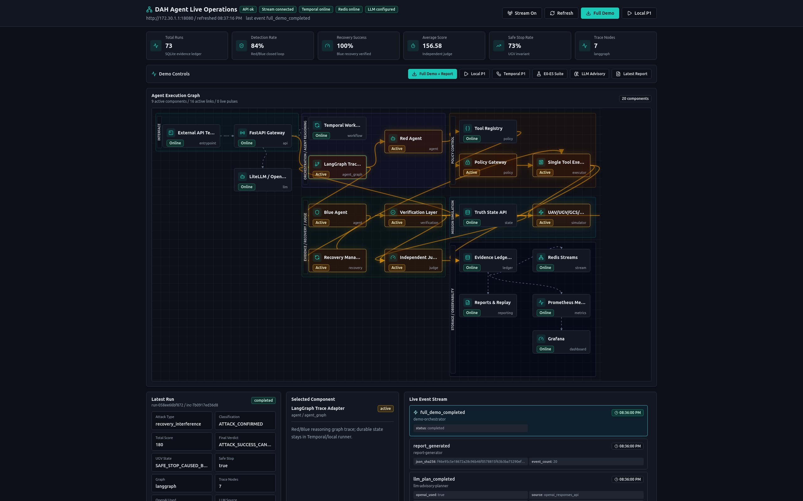
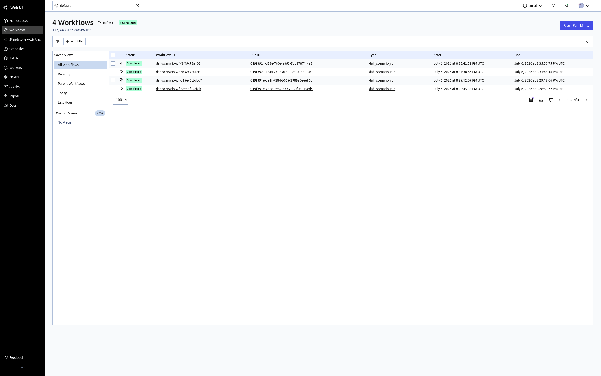
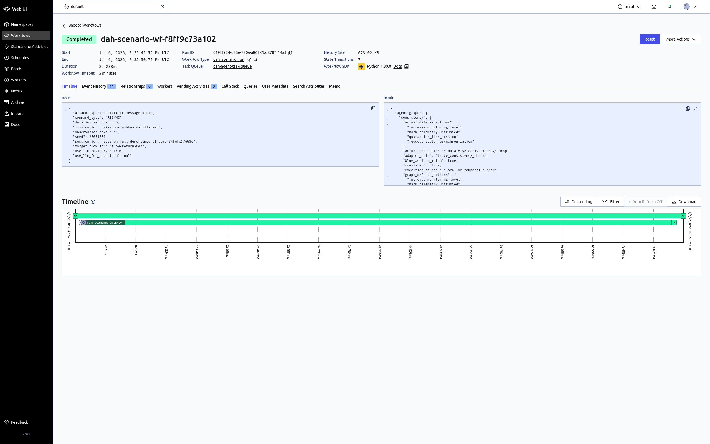
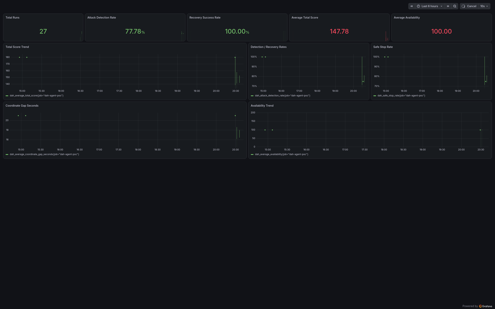

# DAH Agent PoC

Docker-first PoC for the DAH 2026 Red/Blue agent design in this repository. Newly created runtime components are containers. Existing homelab Kubernetes services can be reused for PostgreSQL/Redis where configured.

The app implements a closed loop:

```text
External API / Dashboard
  -> FastAPI Gateway
  -> Local ScenarioRunner or optional Temporal Workflow
  -> LangGraph Red/Blue reasoning trace adapter
  -> Red Agent -> YAML Tool Registry -> Policy Gateway -> Single Tool Executor
  -> Mock UAV/UGV/GCS/Satellite Simulator + Truth State
  -> Verification -> Blue Agent -> Defense/Recovery Tools -> Judge
  -> SQLite Evidence Ledger -> optional Redis Streams mirror -> Reports/Metrics/Grafana
```

It intentionally does not use embedding or reranker models. OpenAI/LiteLLM is used as an advisory typed-plan path during `POST /scenarios/run` and directly through `POST /llm/plan`; LLM output is audited and never executes tools directly. The E2E scenario still works without an OpenAI key by recording a deterministic fallback advisory plan.

## Run

```bash
cp .env.example .env
# OPENAI_BASE_URL defaults to https://litellm.uaysk.com.
# Set OPENAI_API_KEY in .env if you want /scenarios/run and /llm/plan to call LiteLLM/OpenAI.
docker compose up --build -d
```

Temporal workflow mode reuses the existing homelab K8s PostgreSQL service instead of creating a database container. Fill `TEMPORAL_DB_*` in `.env`, set `TEMPORAL_ENABLED=true`, then run. The compose profile mounts `temporal/dynamicconfig/development-sql.yaml` for Temporal file-based dynamic config:

```bash
docker compose --profile temporal up --build -d
```

Temporal endpoints:

- Temporal gRPC: `172.30.1.1:17233`
- Temporal UI: `http://172.30.1.1:18233`
- API health: `http://172.30.1.1:18080/temporal/health`
- Run scenario through Temporal: `POST /temporal/scenarios/run`
- Run E0-E5 suite through Temporal: `POST /temporal/experiments/run-suite`

API:

- Swagger: `http://172.30.1.1:18080/docs`
- Health: `http://172.30.1.1:18080/health`

## External API Test

```bash
curl http://172.30.1.1:18080/health

curl -sS -X POST http://172.30.1.1:18080/scenarios/run \
  -H 'content-type: application/json' \
  -d '{
    "mission_id": "mission-alpha",
    "session_id": "session-17",
    "attack_type": "selective_message_drop",
    "duration_seconds": 30,
    "seed": 26063001
  }'

curl -sS -X POST http://172.30.1.1:18080/demo/run-full \
  -H 'content-type: application/json' \
  -d '{}'
```

The scenario response includes Red plan, attack tool result, Blue classification,
LLM advisory typed plan, defense tool results, recovery verification, Judge verdict,
Truth State, LangGraph/OpenAI advisory graph trace, Evidence Ledger records, and event ledger entries.


## Report-Grade Artifacts


Lightweight UAV/UGV mission simulation:

```bash
curl -sS -X POST http://172.30.1.1:18080/sim/mission \
  -H 'content-type: application/json' \
  -d '{"duration_seconds":60,"drop_start_second":10,"drop_end_second":35}'
```

Simulation policy:

- UAV moves toward a fixed waypoint and emits coordinate reports every tick.
- UGV follows only coordinates with age <= 5 seconds.
- UGV enters `SAFE_STOP_CAUSED_BY_COORD_STALE` after 15 seconds without a valid coordinate.
- Gateway trace records delivered/dropped Return Link coordinate reports.
- GCS display trace records replay-induced display/truth mismatch.

Batch experiment with repeated seeds:

```bash
curl -sS -X POST http://172.30.1.1:18080/experiments/run-batch \
  -H 'content-type: application/json' \
  -d '{"runs":30,"seed_start":26063001,"duration_seconds":30}'
```

Run the DAH E0-E5 experiment suite at smoke scale or report scale:

```bash
curl -sS -X POST http://172.30.1.1:18080/experiments/run-suite \
  -H 'content-type: application/json' \
  -d '{"runs_per_group":3,"duration_seconds":30}'
```

Experiment groups:

- E0: normal baseline
- E1: random low-rate packet loss fault profile
- E2/E3/E4: P1 coordinate report suppression with built-in Red/Blue loop
- E5: bounded P2 recovery/resync interference

The suite response reports attack-group detection rate, false negative rate, fault-group false positive rate, detection/recovery latency, total runs, and per-group run IDs.

Replay a stored run and compare policy/Judge determinism:

```bash
curl -sS -X POST http://172.30.1.1:18080/replay/{run_id}
```

Export report artifacts:

```bash
curl -sS http://172.30.1.1:18080/reports/{run_id}.json
curl -sS http://172.30.1.1:18080/reports/{run_id}.md
```

The JSON/Markdown reports include scenario request, Red plan, Blue evidence, tool audit, verification results, Judge verdict, Appendix A.4-style Judge audit event, and Evidence Ledger records with the common report fields.

Coverage map for report attachment:

```bash
curl -sS http://172.30.1.1:18080/reports/coverage.json
```

## Redis Streams

Redis Streams are optional and use an existing homelab Redis endpoint when enabled. No Redis container is created by this compose file.

```bash
REDIS_STREAMS_ENABLED=true
REDIS_URL=redis://172.30.1.51:6379/0
curl http://172.30.1.1:18080/streams/status
```

Events are mapped to `dah:sim-events`, `dah:attack-events`, `dah:agent-events`, `dah:llm-events`, `dah:defense-events`, `dah:tool-execution-events`, `dah:judge-audit-events`, `dah:workflow-events`, `dah:report-events`, `dah:replay-events`, and `dah:dlq-events`. Redis publish failures do not block the SQLite Evidence Ledger.

## Safety Boundary

- No real UAV, UGV, RF, satellite, shell, SQL, or external attack target access.
- State changes go through `POST /tools/execute`.
- Tool contracts are loaded from `app/policy/tool_registry.yaml` and exposed at `GET /tools/registry`.
- Unknown tools, unsafe targets, and A4-style actions are denied by the Policy Gateway.
- LLM output is advisory typed-plan data only; it is recorded in `llm_plan_*` events and never executes tools directly.


## Live Agent Dashboard

The shadcn/ui-based dashboard is served as a separate Docker container and uses an SSE live event stream from the FastAPI app. The UI defaults to a dark operations theme and pulses the graph nodes/edges touched by incoming events.

- URL: `http://172.30.1.1:18081`
- State API: `http://172.30.1.1:18080/dashboard/state`
- Live SSE API: `http://172.30.1.1:18080/dashboard/events`
- It visualizes FastAPI, Temporal, LangGraph, Red/Blue agents, Tool Registry, Policy Gateway, Single Tool Executor, UAV/UGV simulator, Truth State, verifier, recovery, Judge, SQLite Evidence Ledger, Redis Streams, OpenAI/LiteLLM, reports, metrics, and Grafana.
- External API calls to `/scenarios/run`, `/temporal/scenarios/run`, `/experiments/run-suite`, and `/llm/plan` are reflected through the SSE stream; each ledger event includes the graph node and edge IDs that should pulse in the dashboard. The OpenAI/LiteLLM node pulses on `llm_plan_requested`, `llm_plan_completed`, and `llm_plan_failed`.
- The Demo Controls run Local P1, Temporal P1, E0-E5 Suite, direct LLM Advisory, and Full Demo + Report. Full Demo calls `/demo/run-full`, exercises Local/Temporal/Suite/LLM/Report paths, then downloads the generated JSON report in the browser.

## Grafana Dashboard

Grafana is provisioned as a separate Docker container.

- URL: `http://172.30.1.1:13000`
- User: `admin`
- Password: value of `GRAFANA_ADMIN_PASSWORD` in `.env`
- Dashboard: `DAH Agent PoC - Red/Blue Mission Metrics`

Grafana uses its built-in Prometheus datasource against the app's lightweight compatible endpoint at `http://dah-agent-poc:8080/prometheus`. No Prometheus container is required.

Useful direct metric checks:

```bash
curl 'http://172.30.1.1:18080/prometheus/api/v1/query?query=dah_total_runs'
curl 'http://172.30.1.1:18080/prometheus/api/v1/query?query=dah_average_total_score'
```

## Demo Screenshots

The following 2560x1600 screenshots were captured with Browserless after running `POST /demo/run-full`. They show the main demonstration path from agent execution, through Temporal durable workflow evidence, to Grafana metrics.

### 1. Agent Dashboard - Full Demo Execution

The Agent dashboard is the operator-facing view. It shows `Temporal online`, Redis and LLM status, the `Full Demo + Report` control, live event stream activity, and the connected execution graph covering FastAPI, Temporal, LangGraph, Red/Blue agents, policy, simulator, evidence ledger, reports, metrics, and Grafana.



### 2. Temporal Dashboard - Completed Workflow List

The Temporal dashboard confirms that the optional durable path is active. Completed `dah_scenario_run` workflow executions are visible in the `default` namespace, proving that `/temporal/scenarios/run` and the Full Demo temporal step are reaching Temporal server and worker.



### 3. Temporal Dashboard - Workflow Detail

The workflow detail view shows the selected `dah_scenario_run` execution, its task queue, duration, input payload, and result payload. This is the durable audit trail for the Temporal-backed scenario step.



### 4. Grafana Dashboard - Mission Metrics

Grafana visualizes the Prometheus-compatible metrics served by the DAH API. The dashboard includes total runs, detection rate, recovery success rate, total score, availability, safe-stop rate, coordinate gap, and trend panels populated by recent Full Demo and scenario runs.



## Local Tests

```bash
pytest
```

## Implemented Coverage

This repository implements the report's PoC/MVP surface and adds optional durable workflow/event-stream paths that reuse existing homelab services. Current coverage includes:

- P1 coordinate-report suppression, P2 bounded recovery interference, and P3 display replay-effect simulation.
- E0-E5 smoke/report-scale experiment suite via `/experiments/run-suite`.
- Explicit `command_delivery_anomaly`, `prompt_input_sanitized`, and `safe_containment_entered` evidence events.
- Fault-vs-attack classification for normal baseline and low-rate random packet loss.
- Single Tool Executor, YAML Tool Registry allowlist, Policy Gateway decisions, idempotency, verification, replay, Judge scoring, JSON/Markdown reports, and Grafana metrics.
- LangGraph Red/Blue reasoning trace adapter plus OpenAI/LiteLLM advisory trace node; durable orchestration remains Temporal/local runner.
- Temporal server/UI/worker compose profile with existing K8s PostgreSQL reuse.
- Optional Redis Streams publisher using an existing homelab Redis service.
- Evidence Ledger common fields, incident/evidence/replay tables, `/truth/events`, report coverage API, and modular `red_agent/`, `blue_agent/`, `judge/`, `policy/` packages.
