# DAH Agent PoC Architecture

```mermaid
flowchart LR
    API[External API / Dashboard]
    FAST[FastAPI Gateway]
    RUN[Local ScenarioRunner]
    TEMP[Temporal Workflows optional]
    PG[(Existing K8s PostgreSQL for Temporal)]
    LG[LangGraph Red/Blue Trace Adapter]
    RED[Red Agent]
    REG[YAML Tool Registry]
    POL[Policy Gateway]
    TOOL[Single Tool Executor]
    SIM[Mock UAV/UGV/GCS/Satellite Simulator]
    TRUTH[Truth State]
    VERIFY[Verification Layer]
    BLUE[Blue Agent]
    JUDGE[Independent Judge]
    LEDGER[SQLite Evidence Ledger]
    STREAM[Redis Streams optional mirror]
    REPORT[Reports / Metrics]
    GRAF[Grafana]

    API --> FAST
    FAST --> RUN
    FAST -. optional .-> TEMP
    TEMP --> RUN
    TEMP --> PG
    RUN --> LG
    LG --> RED
    RED --> REG
    REG --> POL
    POL --> TOOL
    TOOL --> SIM
    SIM --> TRUTH
    TRUTH --> VERIFY
    VERIFY --> BLUE
    BLUE --> POL
    VERIFY --> JUDGE
    TRUTH --> JUDGE
    TOOL --> LEDGER
    JUDGE --> LEDGER
    LEDGER -. best effort .-> STREAM
    LEDGER --> REPORT
    REPORT --> GRAF
```

## Runtime Modes

- Local API mode: `docker compose up --build -d` runs FastAPI and Grafana only. Scenario, experiment, replay, report, and Prometheus-compatible endpoints work without Temporal.
- Temporal mode: `docker compose --profile temporal up --build -d` adds `temporal`, `temporal-ui`, and `temporal-worker`. Temporal persistence points to the existing K8s PostgreSQL endpoint configured by `TEMPORAL_DB_*`.
- Redis Streams mode: set `REDIS_STREAMS_ENABLED=true` and `REDIS_URL` to an existing homelab Redis endpoint. SQLite store writes remain authoritative; stream publish is a best-effort mirror.

## Report Mapping

- P1: `simulate_selective_message_drop` and `selective_command_drop` alias.
- P2/E5: `simulate_recovery_interference` plus `safe_containment_entered`.
- P3: `simulate_display_replay_effect` with display/truth mismatch trace.
- LangGraph: `agent_graph` response/report field records Red/Blue reasoning graph nodes and decisions; `langgraph_consistency_checked` compares trace decisions against the executed Red/Blue plans. Durable state remains owned by Temporal or the local runner.
- Evidence Ledger: `events`, `tool_executions`, `evidence_records`, and `/truth/events` expose observed fact, supporting/contradicting evidence, selected action, policy result, tool result, verification result, mission impact, report generation, and judge result.
- Replay: `/replay/{run_id}` stores deterministic comparison in `replay_runs`.
- Experiments: `/experiments/run-suite` covers E0-E5 and reports false positive, false negative, detection latency, recovery time, and score aggregates.
